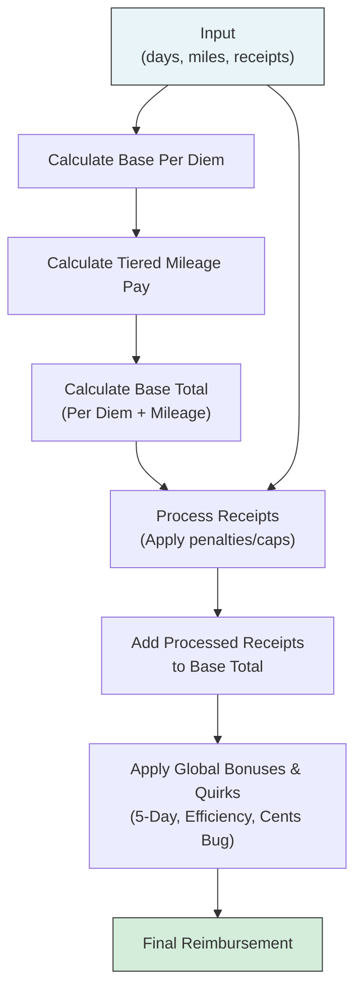

Excellent. Both plans offer valuable strategies. The Gemini plan excels at structured, hypothesis-driven deduction and narrative framing, treating the problem like a cryptographer. The Claude plan provides a strong, practical project management framework, including system diagrams and ideas for automated parameter tuning.

By combining the methodical, intelligence-led approach of Gemini with the practical, optimization-focused tools of Claude, we can create a master plan that is both strategically sound and highly effective in execution.

---

# **Master Plan: Project Black Box Decryption**

## **Mission:** To perfectly replicate the ACME Corp legacy reimbursement system by treating it as a cryptographic puzzle. We will combine human intelligence (deciphering interviews), data science (pattern analysis), and algorithmic optimization to reconstruct the original logic, including all its quirks and bugs.

## **Guiding Principles**
1.  **Trust but Verify:** Employee interviews are our primary intelligence, but every hypothesis must be validated against the `public_cases.json` data.
2.  **Logic over Randomness:** The system is not random; it's an artifact of layered, and likely buggy, 60-year-old logic. We will find that logic.
3.  **Warts and All:** Our goal is not to create a *better* system, but an *identical* one. Bugs are features.
4.  **Component-First:** We will deconstruct the problem and solve it piece by piece (per diem, mileage, receipts, bonuses) before assembling the final formula.

---

### **Phase 1: Intelligence Gathering & Strategy Formulation**

*Objective: To distill all anecdotal evidence into a concrete, prioritized list of testable hypotheses.*

1.  **Source Reliability Assessment (Gemini's Insight):** We will prioritize hypotheses based on the likely reliability of the source.
    *   **Tier 1 (High Confidence):** Kevin (Procurement) & Lisa (Accounting). They work directly with the numbers and have performed their own analysis. Their claims about specific thresholds, rates, and bonuses are our primary starting points.
    *   **Tier 2 (Confirmation):** Marcus (Sales) & Jennifer (HR). They confirm broader patterns (efficiency matters, receipt penalties exist) but lack specific values. Their input is used to validate the direction of our analysis.
    *   **Tier 3 (Context):** Dave (Marketing). Confirms general user sentiment and known pitfalls (e.g., small receipt penalty).

2.  **Red Herring Identification (Gemini's Insight):** We will explicitly discard theories that are untestable with the provided data to avoid wasted effort.
    *   **Discarded:** Lunar cycles, day-of-week submissions, employee history, departmental rules, monthly/quarterly budgets. These cannot be tested without timestamps or user IDs. We assume their effects are either nonexistent or averaged into the existing data.

3.  **Master Hypothesis Ledger:** Create a master checklist of all plausible rules to be investigated. This will be our guide for the entire project.
    *   **Per Diem:** Base rate is ~$100/day.
    *   **Mileage:** Tiered system. Rate drop-off after ~100 miles.
    *   **Receipts:** Penalties for very low amounts. Diminishing returns/penalties for very high amounts, with thresholds dependent on trip length.
    *   **Bonuses:** A specific bonus exists for 5-day trips. An "efficiency bonus" exists for a "sweet spot" of miles/day (e.g., 180-220).
    *   **Bugs:** A small, fixed bonus is applied if receipt cents end in `.49` or `.99`.

---

### **Phase 2: Exploratory Data Analysis (EDA) & Feature Engineering**

*Objective: To find visual and statistical evidence for the hypotheses from Phase 1.*

1.  **Engineer Key Features:** Create composite variables that likely drive the logic.
    *   `miles_per_day` = `miles_traveled` / `trip_duration_days`
    *   `receipts_per_day` = `total_receipts_amount` / `trip_duration_days`
    *   `receipt_cents` = The last two digits of `total_receipts_amount`

2.  **Targeted Visualization:** Create plots specifically designed to test our hypotheses.
    *   **Per Diem Plot:** Plot `reimbursement` vs. `trip_duration_days` for cases with zero miles and receipts to isolate the base per diem rate.
    *   **Mileage Plot:** Subtract the estimated per diem from the reimbursement and plot the remainder vs. `miles_traveled` to visualize the tiered rate structure.
    *   **Efficiency Plot:** After accounting for per diem and mileage, plot the residual error against `miles_per_day` to find the "hump" shape of the efficiency bonus.

3.  **Clustering Analysis (Claude's Insight):** Use a simple clustering algorithm (like k-means) on the input features to see if the data naturally separates into the "calculation paths" Kevin mentioned. This can help confirm if the system uses fundamentally different logic for, e.g., "short, high-mileage" trips vs. "long, low-mileage" trips.

---

### **Phase 3: Core Logic Reconstruction & Bug Replication**

*Objective: To build the reimbursement formula piece by piece, starting simple and layering on complexity.*

This phase implements the findings from our analysis into a single, sequential calculation. The order of operations is critical.

**System Architecture Overview (Claude's Diagram):**


1.  **Initial Model Construction:** We will codify our best guesses for the rules into a single function. This model will be parameterized with "magic numbers" that we will tune in the next phase.

    **(Initial Pseudocode - A Hybrid of Both Plans)**
    ```python
    def calculate_reimbursement(days, miles, receipts):
        # 1. Base Components
        per_diem_pay = days * 100.00  # HYPOTHESIS: $100/day
        mileage_pay = min(miles, 100) * 0.58 + max(0, miles - 100) * 0.45  # HYPOTHESIS: Tiered rates
        
        # 2. Receipt Processing (The most complex part)
        # Start with a base of the full receipt amount, then apply penalties
        receipt_pay = receipts
        receipts_per_day = receipts / days if days > 0 else 0
        
        # PENALTY: High Spending (based on Kevin's tiers)
        if 1 <= days <= 3 and receipts_per_day > 75:
            receipt_pay -= (receipts_per_day - 75) * days * 0.5  # HYPOTHESIS: Penalty factor
        elif 4 <= days <= 7 and receipts_per_day > 120:
            receipt_pay -= (receipts_per_day - 120) * days * 0.75
        elif days >= 8 and receipts_per_day > 90:
            receipt_pay -= (receipts_per_day - 90) * days * 1.0
            
        # PENALTY: Small Receipts (Dave's observation)
        if 0 < receipts and receipts_per_day < 20:
            receipt_pay -= 50.00  # HYPOTHESIS: Flat penalty
        
        # Old systems might not let a bad receipt amount reduce the base pay
        receipt_pay = max(0, receipt_pay)

        # 3. Combine and Apply Global Modifiers
        total = per_diem_pay + mileage_pay + receipt_pay
        
        # BONUS: 5-Day Sweet Spot (Lisa's tip)
        if days == 5:
            total += 75.00  # HYPOTHESIS: Flat bonus

        # BONUS: Efficiency "Hustle" (Kevin's key insight)
        miles_per_day = miles / days if days > 0 else 0
        if 180 <= miles_per_day <= 220:
            total += 65.00  # HYPOTHESIS: Flat bonus

        # BUG: Cents Rounding (Lisa's glitch)
        cents = int((receipts * 100) % 100)
        if cents == 49 or cents == 99:
            total += 7.50  # HYPOTHESIS: Small fixed bonus

        # 4. Final Output Formatting
        return round(total, 2)
    ```

---

### **Phase 4: Iterative Refinement & Optimization**

*Objective: To systematically tune all "magic numbers" until our model perfectly matches all 1,000 public cases.*

1.  **Implementation:** Implement the model in a robust script (e.g., Python, called by `run.sh`).

2.  **Baseline Evaluation:** Run `./eval.sh` to get our initial score, average error, and a list of exact mismatches.

3.  **Error Analysis:** Analyze the cases with the largest errors.
    *   Is the error consistently positive or negative for a certain trip type? Our logic for that "cluster" is wrong.
    *   Is the error proportional to one of the inputs? A rate or penalty factor is wrong.

4.  **Automated Parameter Tuning (Claude's Insight):** Instead of purely manual tweaking, we will use a systematic approach to find the optimal values for our hypothesized parameters (e.g., `daily_rate`, `mileage_rate_1`, `mileage_rate_2`, `5_day_bonus`, etc.).
    *   **Method:** A simple grid search or a more sophisticated optimization algorithm (`scipy.optimize.minimize`) can be used.
    *   **Objective Function:** The function to minimize is the `Average error` reported by `eval.sh`.

5.  **Lockdown:** Once we achieve 1000/1000 exact matches (or as close as possible), the model is **locked**. No further changes will be made.

---

### **Phase 5: Finalization & Submission**

1.  **Generate Private Results:** Run the locked `run.sh` script against `private_cases.json` to produce the final `private_results.txt` file.
2.  **Package Submission:** Ensure the repository is clean, the `run.sh` script is executable and meets all requirements (no external dependencies, runs quickly).
3.  **Submit:** Add the collaborator and submit the form with the generated results.