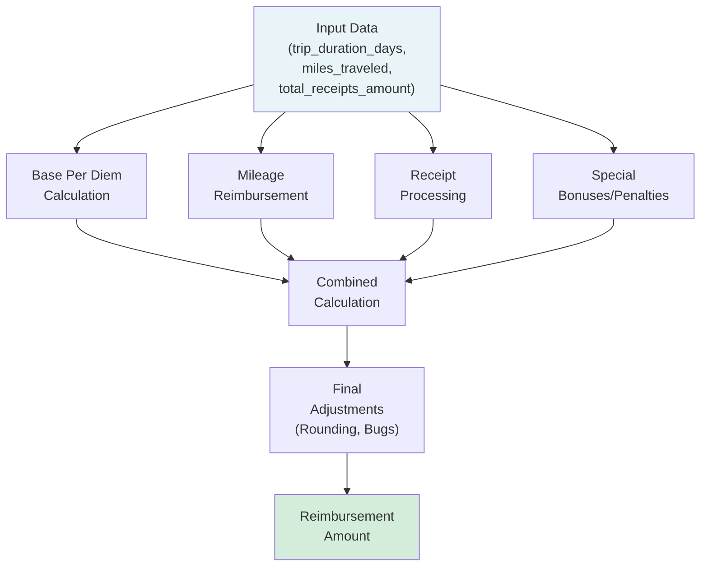

# Plan to Reverse-Engineer ACME Corp's Legacy Reimbursement System

## Executive Summary

This plan outlines a systematic approach to reverse-engineer ACME Corp's 60-year-old reimbursement calculation system using 1,000 test cases and employee interviews. The goal is to create a perfect replica that matches the legacy system's behavior, including any bugs or quirks.

## Understanding the Problem

### Inputs
- `trip_duration_days` (integer): Number of days spent traveling
- `miles_traveled` (integer): Total miles traveled
- `total_receipts_amount` (float): Total dollar amount of receipts

### Output
- Single reimbursement amount (float, rounded to 2 decimal places)

### Key Insights from Interviews

1. **Base Per Diem**: Around $100/day
2. **5-Day Trip Bonus**: Consistent pattern of extra reimbursement for exactly 5-day trips
3. **Mileage Tiers**: First ~100 miles at full rate (~$0.58/mile), then decreasing rates
4. **Receipt Processing**: 
   - Diminishing returns for high amounts
   - Penalties for very low amounts
   - Optimal ranges vary by trip length
5. **Efficiency Bonuses**: Extra reimbursement for 180-220 miles/day
6. **Special Effects**:
   - Rounding bugs for receipts ending in .49 or .99
   - Possible seasonal/timing variations
   - Complex interaction effects between factors

### System Architecture Overview



## Approach

### Phase 1: Data Analysis and Pattern Recognition

1. **Statistical Analysis of Test Cases**
   - Group by trip duration to identify patterns
   - Analyze mileage reimbursement rates across different ranges
   - Study receipt reimbursement patterns
   - Look for outliers and edge cases

2. **Feature Engineering**
   - Calculate derived features:
     - Miles per day (efficiency)
     - Receipts per day
     - Receipt-to-mileage ratio
   - Identify interaction effects between features

3. **Clustering Analysis**
   - Use k-means clustering (as Kevin suggested) to identify different calculation paths
   - Analyze clusters for common characteristics

### Phase 2: Component Modeling

1. **Base Per Diem Component**
   ```
   base_per_diem = trip_duration_days * daily_rate
   if trip_duration_days == 5:
       base_per_diem += bonus
   ```

2. **Mileage Component**
   - Implement tiered rate structure
   - Test for logarithmic or other non-linear curves
   - Account for efficiency bonuses

3. **Receipt Component**
   - Model diminishing returns
   - Identify penalty thresholds
   - Test for trip-length-dependent optimal ranges

4. **Interaction Effects**
   - Model multipliers based on combined factors
   - Test for threshold-based bonuses/penalties

### Phase 3: Bug Replication

1. **Rounding Bugs**
   - Test receipts ending in .49 and .99
   - Identify double-rounding patterns

2. **Edge Cases**
   - Very short trips (1 day)
   - Very long trips (10+ days)
   - Zero or minimal values

3. **Systematic Anomalies**
   - Look for patterns that don't make business sense
   - These are likely bugs to preserve

### Phase 4: Implementation Strategy

1. **Initial Model**
   ```python
   def calculate_reimbursement(days, miles, receipts):
       # Base components
       per_diem = calculate_per_diem(days)
       mileage_reimb = calculate_mileage(miles, days)
       receipt_reimb = calculate_receipts(receipts, days)
       
       # Bonuses/penalties
       efficiency_bonus = calculate_efficiency_bonus(miles, days)
       receipt_penalty = calculate_receipt_penalty(receipts, days)
       
       # Special cases and bugs
       special_adjustments = apply_special_rules(days, miles, receipts)
       
       # Combine with weights/interactions
       total = per_diem + mileage_reimb + receipt_reimb + 
               efficiency_bonus - receipt_penalty + special_adjustments
       
       return round(total, 2)
   ```

2. **Iterative Refinement**
   - Start with simple linear models
   - Add complexity based on error analysis
   - Use genetic algorithms or grid search to optimize parameters

3. **Validation Strategy**
   - Split public cases 80/20 for training/validation
   - Track exact matches (±$0.01) and close matches (±$1.00)
   - Focus on high-error cases to identify missing patterns

### Phase 5: Testing and Optimization

1. **Error Analysis**
   - Categorize errors by trip characteristics
   - Identify systematic biases
   - Look for patterns in misclassified cases

2. **Parameter Tuning**
   - Use optimization algorithms to fine-tune thresholds
   - Test different function forms (linear, logarithmic, polynomial)
   - Validate against held-out test cases

3. **Edge Case Handling**
   - Ensure all 1,000 public cases are handled
   - Test boundary conditions
   - Verify output format compliance

## Implementation Checklist

- [ ] Analyze public_cases.json for patterns
- [ ] Build statistical models for each component
- [ ] Implement base calculation in run.sh
- [ ] Add special case handling
- [ ] Replicate identified bugs
- [ ] Optimize parameters using eval.sh feedback
- [ ] Achieve >95% exact matches on public cases
- [ ] Generate results for private cases
- [ ] Submit solution

## Success Metrics

1. **Primary**: Maximum exact matches (±$0.01) on public cases
2. **Secondary**: Minimize average error
3. **Final**: Performance on 5,000 private cases

## Risk Mitigation

1. **Overfitting**: Use cross-validation to ensure generalization
2. **Missing Patterns**: Systematically test employee theories
3. **Complex Interactions**: Use machine learning to detect non-obvious patterns
4. **Time Constraints**: Prioritize high-impact components first

## Next Steps

1. Parse and analyze public_cases.json
2. Create initial statistical models
3. Implement basic run.sh with core logic
4. Iterate based on eval.sh feedback
5. Refine until achieving >95% accuracy 